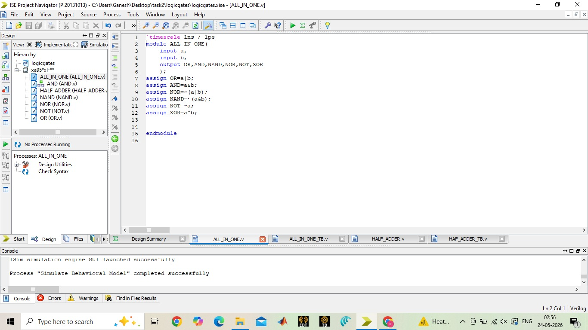
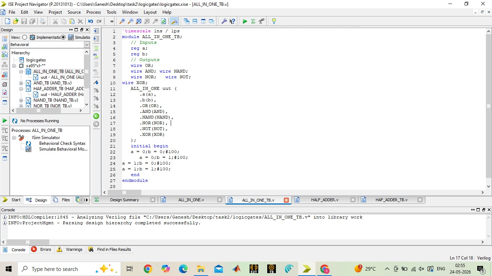
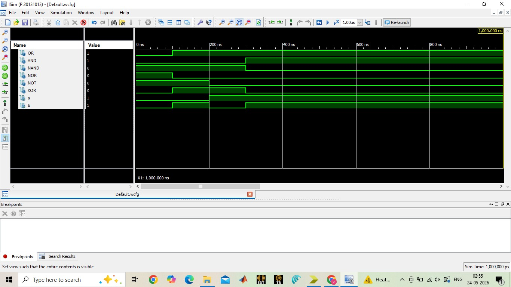
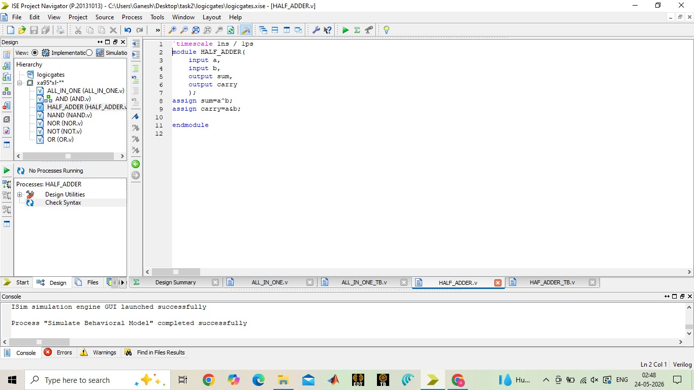
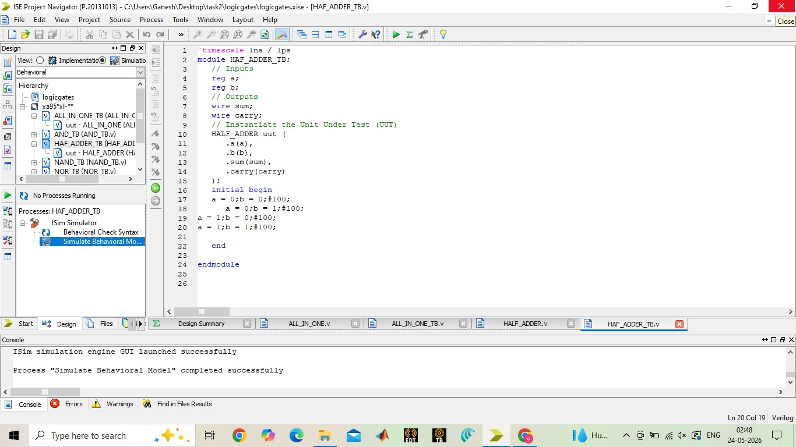
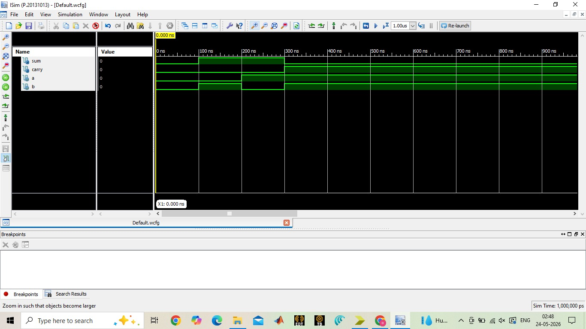
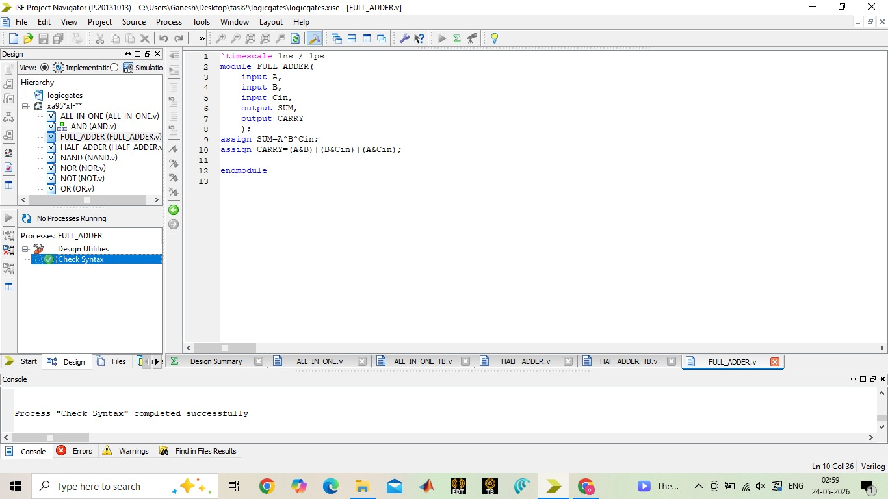
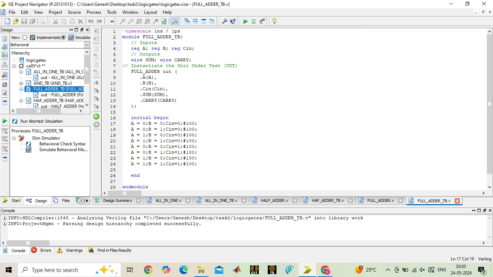
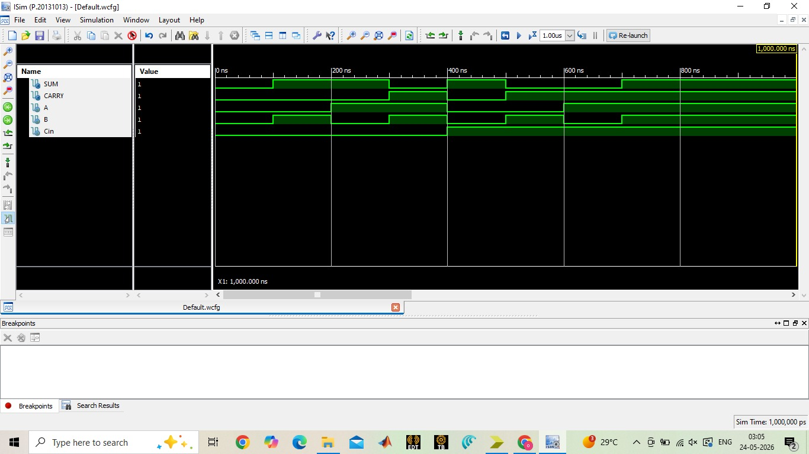

# VLSI-TASK2
# Task_02
## Task_02# VLSI Design Internship – Task 2

## Introduction
This project is part of the VLSI Design Internship program.  
The task focuses on learning Verilog HDL and RTL design concepts by implementing basic combinational circuits.

---

## Objective
- Learn Verilog HDL basics
- Understand RTL design concepts
- Design combinational circuits
- Write testbenches
- Perform simulation and waveform analysis

---

## Tools Used
- Verilog HDL
- EDA Playground
- Icarus Verilog
- GTKWave

---

## Files Included

| File Name | Description |
|------------|-------------|
| ALL_IN_ONE.v | Verilog code for logic gates |
| HALF_ADDER.v | Half adder Verilog code |
| FULL_ADDERr.v | Full adder Verilog code |
| ALL_IN_ONE_TB.v | Simulation and waveform outputs |
| HALF_ADDER_TB.v | Testbench for half adder |
| FUL_ADDER_TB.v | Testbench for full adder |
| SCREENSHOTS/ | Simulation and waveform outputs |

---

## Simulation Procedure
1. Write Verilog HDL code
2. Create testbench
3. Run simulation using Icarus Verilog
4. Analyze outputs using GTKWave
5. Verify waveform outputs

---

# Logic Gates Implementation

## Verilog Code

## TestBench Code

## Simulation Output Waveform

---

# Half Adder Design

## Verilog Code

## TestBench Code

### Truth Table

| A | B | Sum | Carry |
|---|---|---|---|
|0|0|0|0|
|0|1|1|0|
|1|0|1|0|
|1|1|0|1|

## Simulation Output Waveform

---

# Full Adder Design

## Verilog Code

## TestBench Code

### Truth Table

| A | B | Cin | Sum | Cout |
|---|---|---|---|---|
|0|0|0|0|0|
|0|0|1|1|0|
|0|1|0|1|0|
|0|1|1|0|1|
|1|0|0|1|0|
|1|0|1|0|1|
|1|1|0|0|1|
|1|1|1|1|1|

## Simulation Output Waveform

---

## Learning Outcomes
- Understood Verilog module structure
- Learned RTL design methodology
- Implemented combinational circuits
- Performed simulation and debugging
- Analyzed waveform outputs

---

## Author
Nagireddy Manoj Sai Krishna

VLSI Intern
